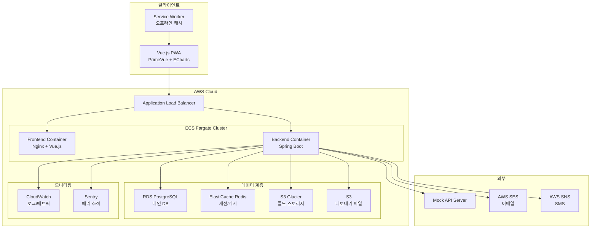
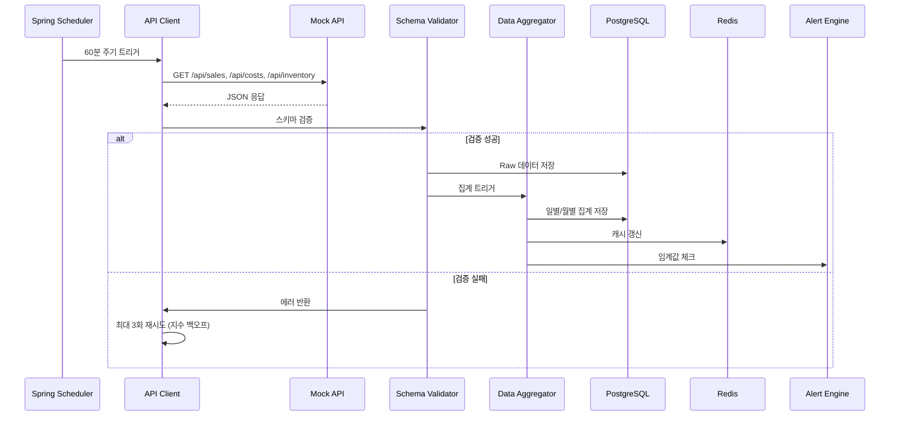
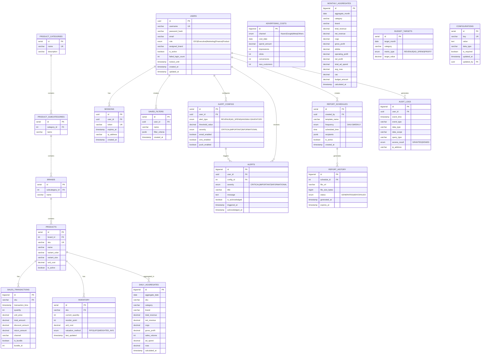

# Design Document: Retail Dashboard Web Application

## Overview

리테일 기업을 위한 종합 P&L(Profit & Loss) 대시보드 웹 애플리케이션의 기술 설계 문서입니다. 본 시스템은 Mock API로부터 매출, 이익, 광고비, 상품별 판매량, 재고 데이터를 1시간 주기로 수집하고, 역할 기반 접근 제어를 통해 30명의 동시 사용자에게 적절한 데이터를 제공합니다. 5년간의 데이터를 보관하며, 자동 리포트 생성, 알림, 오프라인 모드를 지원합니다.

### 기술 스택

| 영역 | 기술 | 선정 이유 |
|------|------|-----------|
| 백엔드 | Java 17 + Spring Boot 3.x | 엔터프라이즈 안정성, 풍부한 생태계 |
| 프론트엔드 | Vue.js 3 + Vite | 가볍고 학습 곡선 낮음, Composition API로 코드 간결 |
| UI 프레임워크 | PrimeVue | 무료, 가볍고 Vue.js 전용 컴포넌트 풍부 |
| 차트 | Apache ECharts | 무료, 디자인 우수, 대규모 데이터 렌더링 성능 |
| 데이터베이스 | PostgreSQL 15 | 무료, 시계열 쿼리 성능 우수, 파티셔닝 지원 |
| 캐시 | Redis | 세션 관리, API 응답 캐싱 |
| 인프라 | AWS ECS + Fargate | 서버리스 컨테이너, 30명 동시 사용자에 적합 |
| CI/CD | GitHub Actions | 무료 티어 활용, AWS 연동 용이 |
| 컨테이너 | Docker | 프론트엔드, 백엔드, DB 분리 배포 |

### 핵심 설계 결정

1. **ECS Fargate 선택**: 30명 동시 사용자 규모에서 EKS는 과도한 오버헤드. Fargate로 관리 부담 최소화
2. **PostgreSQL 파티셔닝**: 5년 데이터 보관을 위해 월별 파티셔닝 적용. TimescaleDB 확장 없이 네이티브 파티셔닝 사용
3. **Redis 세션 관리**: 동시 로그인 방지를 위해 서버 사이드 세션을 Redis에 저장
4. **사전 집계 테이블**: 1시간 주기 데이터 수집 시 일별/월별 집계를 미리 계산하여 쿼리 성능 확보

## Architecture

### 시스템 아키텍처



### 데이터 흐름




## Components and Interfaces

### 백엔드 컴포넌트 (Spring Boot)

```mermaid
graph LR
    subgraph Controller["Controller Layer"]
        AuthCtrl["AuthController"]
        DashCtrl["DashboardController"]
        ExportCtrl["ExportController"]
        ReportCtrl["ReportController"]
        AlertCtrl["AlertController"]
        FilterCtrl["FilterController"]
        ConfigCtrl["ConfigController"]
    end

    subgraph Service["Service Layer"]
        AuthSvc["AuthService"]
        DataSvc["DataAggregationService"]
        ExportSvc["ExportService"]
        ReportSvc["ReportSchedulerService"]
        AlertSvc["AlertEngine"]
        FilterSvc["FilterService"]
        AuditSvc["AuditService"]
        ConfigSvc["ConfigParserService"]
    end

    subgraph Repository["Repository Layer"]
        UserRepo["UserRepository"]
        SalesRepo["SalesRepository"]
        CostRepo["CostRepository"]
        InventoryRepo["InventoryRepository"]
        AuditRepo["AuditLogRepository"]
        FilterRepo["SavedFilterRepository"]
        ReportRepo["ReportRepository"]
        AlertRepo["AlertConfigRepository"]
    end

    Controller --> Service
    Service --> Repository
```



### 주요 인터페이스

#### 1. API Client (Mock API 수집)

```java
public interface ApiClient {
    SalesDataResponse fetchSalesData(LocalDateTime from, LocalDateTime to);
    AdvertisingCostResponse fetchAdvertisingCosts(LocalDateTime from, LocalDateTime to);
    InventoryResponse fetchInventory();
    PnlMetricsResponse fetchPnlMetrics(LocalDateTime from, LocalDateTime to);
}

@Service
public class MockApiClient implements ApiClient {
    private final RestTemplate restTemplate;
    private final RetryTemplate retryTemplate; // 최대 3회, 지수 백오프
    
    @Scheduled(fixedRate = 3600000) // 60분 주기
    public void scheduledFetch() { ... }
}
```

#### 2. Authentication Module

```java
public interface AuthenticationService {
    AuthToken login(LoginRequest request);
    void logout(String sessionId);
    void validateSession(String sessionId);
    void terminatePreviousSession(String userId);
}

public interface AuthorizationService {
    boolean hasAccess(String userId, DataType dataType);
    Set<String> getAccessibleBrands(String userId);
    Role getUserRole(String userId);
}
```

#### 3. Data Aggregator

```java
public interface DataAggregationService {
    // P&L 계산
    BigDecimal calculateTotalRevenue(DateRange range, FilterCriteria filters);
    BigDecimal calculateNetRevenue(DateRange range, FilterCriteria filters);
    BigDecimal calculateCOGS(DateRange range, InventoryValuationMethod method);
    BigDecimal calculateGrossProfit(DateRange range, FilterCriteria filters);
    BigDecimal calculateEBITDA(DateRange range, FilterCriteria filters);
    BigDecimal calculateOperatingProfit(DateRange range, FilterCriteria filters);
    BigDecimal calculateNetProfit(DateRange range, FilterCriteria filters);
    
    // 광고 메트릭
    BigDecimal calculateROAS(DateRange range, AdChannel channel);
    BigDecimal calculateCAC(DateRange range);
    
    // 비교 분석
    ComparisonResult calculateYoY(DateRange range, MetricType metric);
    ComparisonResult calculateMoM(DateRange range, MetricType metric);
    ComparisonResult calculateBudgetVariance(DateRange range, MetricType metric);
    
    // 상품 집계
    List<ProductMetrics> aggregateByHierarchy(HierarchyLevel level, DateRange range);
    BigDecimal calculateInventoryTurnover(String sku, DateRange range);
}
```

#### 4. Export Service

```java
public interface ExportService {
    ExportResult exportToExcel(ExportRequest request);
    ExportResult exportToPdf(ExportRequest request);
    ExportResult exportToPowerPoint(ExportRequest request);
}

public record ExportRequest(
    FilterCriteria filters,
    List<ChartSnapshot> charts,
    ExportFormat format,
    String userId
) {}

public record ExportResult(
    String downloadUrl,    // 24시간 유효 S3 presigned URL
    long fileSizeBytes,
    LocalDateTime expiresAt
) {}
```

#### 5. Alert Engine

```java
public interface AlertEngine {
    void checkRevenueThreshold(BigDecimal currentRevenue, BigDecimal target);
    void checkAdSpendBudget(BigDecimal currentSpend, BigDecimal budget);
    void detectSalesAnomaly(String sku, List<BigDecimal> recentVolumes);
    void checkInventoryLevel(String sku, int currentStock, int reorderPoint);
    
    List<Alert> getActiveAlerts(String userId);
    void configureThreshold(String userId, AlertConfig config);
}

public enum AlertSeverity { CRITICAL, IMPORTANT, INFORMATIONAL }
```

#### 6. Configuration Parser

```java
public interface ConfigurationParser {
    Configuration parse(String configContent) throws ConfigParseException;
    String prettyPrint(Configuration config);
    ValidationResult validate(Configuration config);
}

public record ConfigParseException(
    int lineNumber,
    String fieldName,
    String expectedFormat,
    String actualValue
) extends Exception {}
```

### 프론트엔드 컴포넌트 (Vue.js)

```
src/
├── components/
│   ├── charts/
│   │   ├── TimeSeriesChart.vue      # ECharts 시계열 차트
│   │   ├── BarComparisonChart.vue   # 비교 막대 차트
│   │   ├── PieCompositionChart.vue  # 구성비 파이 차트
│   │   └── DrillDownChart.vue       # 드릴다운 차트
│   ├── dashboard/
│   │   ├── KpiCard.vue              # KPI 카드
│   │   ├── PnlSummary.vue          # P&L 요약
│   │   ├── ProductHierarchy.vue     # 상품 계층 트리
│   │   └── AlertBanner.vue          # 알림 배너
│   ├── filters/
│   │   ├── DateRangePicker.vue      # 날짜 범위 선택
│   │   ├── MultiFilter.vue          # 다중 필터
│   │   └── SavedFilters.vue         # 저장된 필터
│   ├── export/
│   │   └── ExportDialog.vue         # 내보내기 다이얼로그
│   └── common/
│       ├── LoadingSkeleton.vue      # 스켈레톤 로딩
│       └── OfflineBanner.vue        # 오프라인 배너
├── views/
│   ├── LoginView.vue
│   ├── DashboardView.vue
│   ├── ReportView.vue
│   ├── AlertConfigView.vue
│   └── MobileDashboardView.vue
├── stores/                          # Pinia 상태 관리
│   ├── authStore.ts
│   ├── dashboardStore.ts
│   ├── filterStore.ts
│   └── alertStore.ts
├── services/
│   ├── apiService.ts                # Axios HTTP 클라이언트
│   ├── cacheService.ts              # LocalStorage 캐시 (50MB 제한)
│   └── notificationService.ts       # Push 알림
├── router/
│   └── index.ts                     # Vue Router + 권한 가드
└── sw.ts                            # Service Worker (PWA)
```

### REST API 설계

#### 인증 API

| Method | Endpoint | 설명 |
|--------|----------|------|
| POST | `/api/v1/auth/login` | 로그인 |
| POST | `/api/v1/auth/logout` | 로그아웃 |
| GET | `/api/v1/auth/session` | 세션 확인 |

#### 대시보드 API

| Method | Endpoint | 설명 |
|--------|----------|------|
| GET | `/api/v1/dashboard/summary` | P&L 요약 메트릭 |
| GET | `/api/v1/dashboard/revenue` | 매출 데이터 |
| GET | `/api/v1/dashboard/costs` | 비용 데이터 (권한 필요) |
| GET | `/api/v1/dashboard/advertising` | 광고비 데이터 |
| GET | `/api/v1/dashboard/products` | 상품별 데이터 |
| GET | `/api/v1/dashboard/inventory` | 재고 데이터 |
| GET | `/api/v1/dashboard/comparison` | YoY/MoM 비교 |

#### 필터 API

| Method | Endpoint | 설명 |
|--------|----------|------|
| GET | `/api/v1/filters` | 저장된 필터 목록 |
| POST | `/api/v1/filters` | 필터 저장 |
| GET | `/api/v1/filters/{id}` | 필터 로드 |
| DELETE | `/api/v1/filters/{id}` | 필터 삭제 |
| GET | `/api/v1/search/products` | 상품 검색 |

#### 내보내기 API

| Method | Endpoint | 설명 |
|--------|----------|------|
| POST | `/api/v1/export/excel` | Excel 내보내기 |
| POST | `/api/v1/export/pdf` | PDF 내보내기 |
| POST | `/api/v1/export/ppt` | PPT 내보내기 |
| GET | `/api/v1/export/{id}/download` | 파일 다운로드 |

#### 리포트 API

| Method | Endpoint | 설명 |
|--------|----------|------|
| GET | `/api/v1/reports/templates` | 리포트 템플릿 목록 |
| POST | `/api/v1/reports/schedules` | 스케줄 생성 |
| GET | `/api/v1/reports/history` | 리포트 이력 |
| GET | `/api/v1/reports/{id}/download` | 리포트 다운로드 |

#### 알림 API

| Method | Endpoint | 설명 |
|--------|----------|------|
| GET | `/api/v1/alerts` | 활성 알림 목록 |
| PUT | `/api/v1/alerts/config` | 알림 설정 변경 |
| POST | `/api/v1/alerts/{id}/acknowledge` | 알림 확인 |

#### 설정 API

| Method | Endpoint | 설명 |
|--------|----------|------|
| GET | `/api/v1/config` | 현재 설정 조회 |
| PUT | `/api/v1/config` | 설정 업데이트 |
| POST | `/api/v1/config/validate` | 설정 검증 |

공통 쿼리 파라미터:
- `from`, `to`: ISO 8601 날짜 범위
- `category`, `brand`, `sku`: 상품 필터
- `channel`: 광고 채널 필터
- `granularity`: `daily | weekly | monthly | quarterly | yearly`
- `page`, `size`: 페이지네이션 (기본 size=50)


## Data Models

### ERD (Entity Relationship Diagram)



### 테이블 파티셔닝 전략

5년 데이터 보관을 위해 대용량 테이블에 월별 파티셔닝을 적용합니다:

```sql
-- 판매 트랜잭션 파티셔닝
CREATE TABLE sales_transactions (
    id BIGSERIAL,
    sku VARCHAR(50),
    transaction_time TIMESTAMP NOT NULL,
    -- ... 기타 컬럼
) PARTITION BY RANGE (transaction_time);

-- 월별 파티션 자동 생성 (pg_partman 또는 cron)
CREATE TABLE sales_transactions_2024_01 
    PARTITION OF sales_transactions
    FOR VALUES FROM ('2024-01-01') TO ('2024-02-01');
```

파티셔닝 대상 테이블:
- `sales_transactions`: 월별 파티셔닝
- `daily_aggregates`: 월별 파티셔닝
- `audit_logs`: 월별 파티셔닝

### 데이터 아카이빙

2년 이상 된 데이터는 S3 Glacier로 이동:

```
Active (0-2년) → PostgreSQL (Hot Storage)
Archive (2-5년) → S3 Glacier (Cold Storage, 압축)
Delete (5년+) → 자동 삭제
```

### 인덱스 전략

```sql
-- 자주 사용되는 쿼리 패턴에 대한 인덱스
CREATE INDEX idx_sales_sku_time ON sales_transactions(sku, transaction_time);
CREATE INDEX idx_sales_channel_time ON sales_transactions(channel, transaction_time);
CREATE INDEX idx_daily_agg_date_sku ON daily_aggregates(aggregate_date, sku);
CREATE INDEX idx_daily_agg_date_brand ON daily_aggregates(aggregate_date, brand);
CREATE INDEX idx_monthly_agg_month ON monthly_aggregates(aggregate_month);
CREATE INDEX idx_audit_user_time ON audit_logs(user_id, event_time);
CREATE INDEX idx_inventory_sku ON inventory(sku);
CREATE INDEX idx_ad_costs_channel_date ON advertising_costs(channel, cost_date);
```

